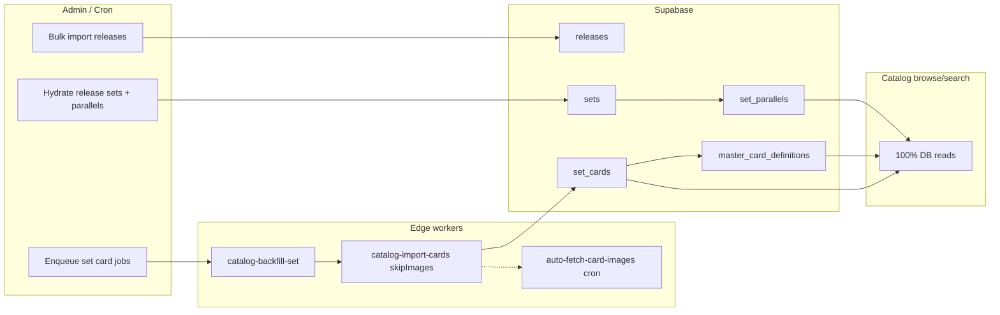

# Catalog backfill plan (CardSight → Vault)

Goal: pre-populate the vault catalog (`releases`, `sets`, `set_parallels`, `set_cards`, base `master_card_definitions`) so **catalog browse** and **catalog search** never need runtime CardSight calls.

Related code: `catalog-import-*` edge functions, `catalog-lazy-import`, admin `AdminCatalogScreen`, `CatalogScreen` browse/search.

---

## Current state (baseline)

| Surface | Data source |
|--------|-------------|
| Browse releases | DB (`browseReleases`) |
| Browse sets | DB (`getSetsForRelease`); lazy `catalog-import-sets` if empty |
| Browse cards | DB (`searchMasterCards` / `set_card_base_variants`); lazy `catalog-import-cards` if empty |
| Search tab | DB (`searchCatalog`) — already no CardSight |
| Admin release list | `cardsight_release_index` when fresh; else one CardSight paginated sync → cache, then DB (`catalog-releases-list`) |
| Scan / bulk add | Still uses CardSight (out of scope for browse/search) |

Minimum spine per set for offline browse/search:

```
releases → sets → set_parallels → set_cards → master_card_definitions (base parallel)
```

Images are optional for navigation; use `auto-fetch-card-images` cron after card import.

---

## Phases

### Phase 0 — Visibility (coverage reporting)

**Status: done** (apply migrations + redeploy `catalog-releases-list`)

- [x] `cardsight_release_index` + `cardsight_segment_sync` — cache CardSight release list pages; admin loads from DB when cache is fresh (7d TTL); `refresh: true` to re-sync

- [x] Plan document (this file)
- [x] SQL views: `catalog_set_coverage`, `catalog_release_coverage` (`20260519120000_catalog_coverage_views.sql`)
- [x] Admin UI: release-level and set-level coverage stats + release summary banner
- [x] `catalog-releases-list` returns card/parallel totals for vault releases

**Deliverables**

- Per-set: `vault_card_count` vs `expected_card_count`, `parallel_count`, completeness flags
- Per-release: aggregated sets/cards/parallels complete counts
- Admin can see what’s left before running a large backfill

---

### Phase 1 — Hydrate release (sets + parallels)

**Status: done** (deploy `catalog-hydrate-release`; redeploy `catalog-import-sets` if using shared release import module)

- [x] Edge function `catalog-hydrate-release`: upsert release + sets, then `GET /v1/catalog/sets/{id}` per set → `set_parallels` (150ms delay between sets; admin-only)
- [x] Shared `_shared/catalog_release_import.ts` + `hydrateSetParallelsFromCardsight` in `catalog_set_parallels.ts`
- [x] Admin: **Import all sets + parallels** / **Re-import sets + parallels** on release sets screen (`hydrateReleaseCatalog`)

---

### Phase 2 — Full release import (one button)

**Status: done** (deploy `catalog-import-release`, `catalog-import-cards`)

- [x] `catalog-import-release` — release + sets + parallels + cards in one admin call; no images
- [x] Shared `_shared/catalog_import_cards.ts`; `catalog-import-cards` refactored (no image fetch)
- [x] Admin sets screen: **Import release** (replaces separate hydrate + bulk card import)
- [ ] Job table `catalog_import_jobs` + progress UI for very large releases (optional)
- [ ] Optional: pg_cron drains pending jobs; or local overnight script for initial mega-backfill

---

### Phase 3 — Operational rollout

- [ ] Backfill by sport/year priority
- [ ] Periodic diff for new CardSight releases

---

### Phase 4 — App hardening

- [ ] Keep or gate lazy import in browse (fallback only)
- [ ] Bulk add: DB search instead of `catalog-search-cards`
- [ ] Deprecate unused `catalog-search` paths in mobile

---

### Phase 5 — Images (async)

- [ ] Rely on / tune `auto-fetch-card-images` cron during backfill

---

## Architecture (target)



---

## Out of scope (v1)

- Importing every parallel-specific CardSight checklist row as separate `master_card_definitions` (base + `ensureCatalogVariant` remains the model)
- Scan/identify CardSight usage
- Postgres full-text search (defer until `ilike` is too slow)

---

## Notes

- `catalog-import-cards` now auto-imports parallels when missing (shared `_shared/catalog_set_parallels.ts`).
- **Phase 2** (`catalog-import-release`) is the preferred admin path: sets + parallels + cards, `skipImages` (use `auto-fetch-card-images` cron + lazy fetch on catalog visit).
- **Phase 1** (`catalog-hydrate-release`) remains for parallels-only refresh without re-importing cards.
- `catalog-import-sets` still only upserts set shells (+ `cardsight_parallel_count`); browse lazy-import unchanged.
- Re-run imports are safe (upsert on `cardsight_card_id`, `set_id,name` for parallels).
